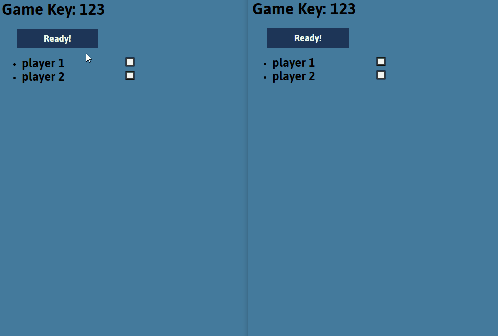

# Stupide-Vautour game
## How to play
Each turn a card from the deck is turned over; all players then place a card from their hand, face down, and turn it over simultaneously. If the card in play is a mouse, the player who placed the highest value card wins it. If it's a vulture, it's the one who put down the lowest card who has to take it!
When 2 players play a card of the same value, these 2 cards are immediately discarded. To avoid raptors, you need a little memory, a hint of foresight and a bit of strategy
## Demo

## Frameworks and languages
### Front-end:
HTML, CSS, React JS.
### Back-end:
JavaScript, Node JS, Socket.IO
